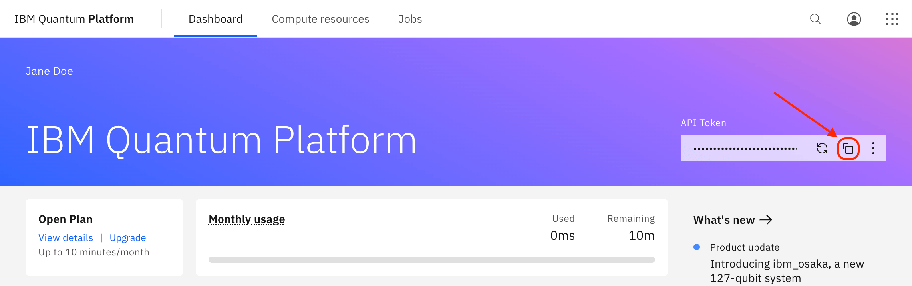

# Hello Quantum World - Classroom Kit

Welcome to the Hello Quantum World - Classroom Kit! This repository contains all the resources you need to briefly introduce your students to the basics of quantum computing and guide them through running code on an IBM quantum computer.

## Files

- [**`quantum_notebook.ipynb`**](./quantum_notebook.ipynb): A ready-to-use Jupyter Notebook that guides students through connecting to an IBM quantum computer and running their first quantum circuit. This notebook is hands-on, allowing students to follow along and test the code themselves.

- [**`lesson_plan.md`**](./lesson_plan.md): A full lesson plan designed to help educators introduce quantum computing concepts in a classroom setting. It includes objectives, key concepts, activities, and discussion prompts to engage students and make quantum computing approachable.

- [**`cheat_sheet.md`**](./cheat_sheet.md): A quick-reference guide with definitions of key terms used in the lesson. This cheat sheet helps students understand and remember essential quantum computing vocabulary.

## Getting Started with the Notebook 

1. **Set up a Class**: [Create a class on Grader Than](https://docs.graderthan.com/courses/create/).
2. **Enroll Your Students**: Follow this [guide](https://docs.graderthan.com/courses/my-class/) to help your students join the class.
3. **IBM Quantum Account**: As a teacher, you’ll need an IBM Quantum account to access an API token to run code on IBM’s quantum computers. Every account includes 10 free minutes of quantum computer usage per month. Sign up at [IBM Quantum](https://quantum-computing.ibm.com/). Only teachers need an IBM account; you can share your API token with students temporarily.
4. **Locate the API Token**: Once signed in, find your API token in the top right corner of the IBM Quantum dashboard. Here’s an example image to guide you:
   

5. **Follow the Notebook**: Open `quantum_notebook.ipynb` and follow the steps with your class, using the lesson plan for context and extra guidance.
6. **Add the API Token to the Code**: When you reach the second code cell, have students add your API token to the `tokens` list like this:

   ```python
   tokens = ["your_token_here"]
   ```

   Then, continue with the rest of the cells.

7. **Refer to the Cheat Sheet**: Use `cheat_sheet.md` to clarify any terms or concepts that students find challenging during the lesson.

8. **In-Class Activities**: When you reach the second-to-last code cell and are waiting for the results, it’s a good time to work on the in-class activities provided in the lesson plan.

Enjoy exploring the exciting world of quantum computing with your students!