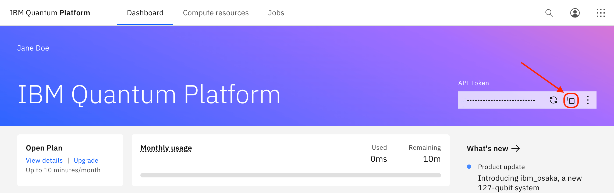

# Hello Quantum World - Classroom Kit

Welcome to the Hello Quantum World Classroom Kit! This repository contains everything you need to introduce your students to quantum computing and guide them through running code on a real IBM quantum computer.

No prior quantum computing experience is required — this kit is designed to make quantum accessible and engaging for high school students.

## What's Included

| File | Description |
|------|-------------|
| [**`quantum_notebook.ipynb`**](./quantum_notebook.ipynb) | A hands-on Jupyter Notebook that walks students through creating and running their first quantum circuit. Students will create quantum entanglement on a real quantum computer! |
| [**`lesson_plan.md`**](./lesson_plan.md) | A complete lesson plan with learning objectives, discussion prompts, and activities to help you teach quantum computing concepts. |
| [**`cheat_sheet.md`**](./cheat_sheet.md) | A quick-reference guide defining key quantum computing terms. Great for students to keep open during the lesson. |

## Before Class: Setup Instructions

### 1. Set Up Your Grader Than Workspace

1. **Create a Class**: [Follow this guide](https://docs.graderthan.com/courses/create/) to create a class on Grader Than.
2. **Enroll Your Students**: Use [this guide](https://docs.graderthan.com/courses/my-class/) to help students join your class.

### 2. Get Your IBM Quantum API Token

You'll need an IBM Quantum account to run code on real quantum computers. Every free account includes **10 minutes of quantum computer time per month** — plenty for a classroom demo!

1. **Sign up** at [IBM Quantum](https://quantum.ibm.com/) (it's free)
2. **Find your API token**: After signing in, click on your profile icon in the top right corner and go to "Account settings" to copy your API token.

   

> **Note**: Only you (the teacher) need an IBM account. You'll share your API token with students during the lesson so they can run the code.

### 3. Download This Repository

In your Grader Than Workspace terminal, run this command:

```bash
git clone https://github.com/GraderThan/HelloQuantumWorld.git
```


## During Class: Running the Lesson

### Step 1: Open the Notebook

Open `quantum_notebook.ipynb` in your Grader Than Workspace. Use the lesson plan (`lesson_plan.md`) to guide your explanations.

### Step 2: Add Your API Token

When you reach the "Connect to IBM Quantum Cloud" section, students will need your API token. There are two options:

**Option A** - Set as environment variable (recommended for sharing):
```python
# The notebook reads from this environment variable
# Set it in your terminal before starting: export IBM_Q_CLOUD_API_KEY="your_token_here"
```

**Option B** - Paste directly in the code:
```python
token = "your_token_here"  # Replace the os.environ.get() line with this
```

### Step 3: Run Through the Notebook

Work through each cell with your students. The notebook is designed to be self-explanatory, but the lesson plan provides additional context and talking points.

### Step 4: While Waiting for Results

When you submit the job to the quantum computer (the "Run the circuit" cell), there may be a wait time of a few seconds to several minutes depending on queue length. This is a great time to:

- Discuss what's happening behind the scenes
- Work through the in-class activities in the lesson plan
- Answer student questions
- Review the cheat sheet together

### Step 5: Celebrate!

When the results come back, your students will have created and verified **quantum entanglement** on a real quantum computer — something Einstein famously called "spooky action at a distance"!

## Tips for Success

- **Test it yourself first**: Run through the entire notebook before class to make sure everything works and to get a feel for the wait times.
- **Have the cheat sheet ready**: Keep `cheat_sheet.md` open or printed out for quick reference during questions.
- **Embrace the wait**: The queue time is actually a great teaching moment about how rare and valuable quantum computers are!
- **It's okay not to know everything**: Quantum computing is cutting-edge science. It's fine to say "I don't know, let's find out together."

## Troubleshooting

| Problem | Solution |
|---------|----------|
| "Token not found" error | Make sure you've added your API token correctly (no extra spaces or quotes) |
| Long wait times | IBM quantum computers are shared globally. Try running during off-peak hours (early morning US time) |
| Job fails | Quantum computers occasionally have issues. Simply re-run the cell to submit a new job |
| Package installation errors | Make sure you run the first code cell (`pip install...`) before running other cells |

## Questions or Feedback?

We'd love to hear how your quantum computing lesson went! Reach out to us at [Grader Than](https://graderthan.com).

---

Enjoy exploring the exciting world of quantum computing with your students! 🚀
